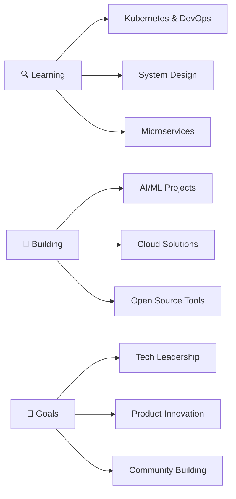

# Hi there, I'm Dharaneesh Rameshkumar! 👋

<div align="center">
  
  

  
  
</div>

---

## 🚀 About Me

> *"Code is like humor. When you have to explain it, it's bad."* – Cory House

Hey there! 👋 I'm **Dharaneesh Rameshkumar**, a passionate **Full Stack Developer** and **AI/ML Enthusiast** who believes in turning ideas into reality through elegant code. I love exploring new technologies, building innovative solutions, and contributing to the open-source community.

- 🔭 **Currently working on:** Git Nanba AI, Agro Cloud Systems
- 🌱 **Currently learning:** Advanced C++, Spring Boot, AWS DevOps, React Native
- 🎯 **2025 Goals:** Contribute to 50+ open source projects, Master Kubernetes
- 💡 **Fun fact:** I debug code faster when listening to lo-fi music! 🎵
- 📫 **Reach me at:** dharaneeshrs777@gmail.com
- 🌍 **Location:** India
- ⚡ **Motto:** *"Learn, Build, Share, Repeat"*

---

## 🛠️ Tech Arsenal

<div align="center">

### 💻 Programming Languages
<p>
  
  
  
  
  
  
</p>

### 🌐 Frontend Development
<p>
  
  
  
  
  
</p>

### 🔧 Backend Development
<p>
  
  
  
  
  
</p>

### 🗄️ Databases
<p>
  
  
  
  
</p>

### ☁️ Cloud & DevOps
<p>
  
  
  
  
</p>

### 🤖 AI/ML & Data Science
<p>
  
  
  
  
  
</p>

### 🛠️ Tools & IDEs
<p>
  
  
  
  
</p>

</div>

---

## 📊 GitHub Analytics

<div align="center">
  
  
</div>

<div align="center">
  
</div>

<div align="center">
  
</div>

---

## 🔥 Contribution Graph

<div align="center">
  
[](https://github.com/ashutosh00710/github-readme-activity-graph)

</div>

---

## 🎯 Featured Projects

<div align="center">

<table>
<tr>
<td width="50%">

### 🚀 [Swift Connect](https://github.com/Dharaneesh20/Swift_Connect)
**Real-time Communication Platform**
- 💬 Instant messaging & video calls
- 🔐 End-to-end encryption
- 📱 Cross-platform compatibility
- **Tech:** React, Node.js, Socket.io, MongoDB

</td>
<td width="50%">

### 🤖 [Git Nanba AI](https://dharaneesh20.github.io/Git-Nanba-AI/)
**AI-Powered Development Assistant**
- 🧠 Intelligent code suggestions
- 📊 Project analytics & insights
- 🔍 Smart repository search
- **Tech:** Python, FastAPI, Transformers, React

</td>
</tr>
<tr>
<td width="50%">

### 🏥 [MedAi](https://github.com/Dharaneesh20/MedAi)
**Healthcare AI Platform**
- 📋 Medical diagnosis assistance
- 💊 Drug interaction checker
- 📈 Health monitoring dashboard
- **Tech:** Python, TensorFlow, Django, PostgreSQL

</td>
<td width="50%">

### 🌾 Agro Cloud Systems
**Smart Agriculture Platform**
- 🌡️ IoT sensor integration
- 📊 Crop yield prediction
- 🛰️ Satellite imagery analysis
- **Tech:** Python, AWS IoT, React, MongoDB

</td>
</tr>
</table>

</div>

---

## 🎓 Certifications & Achievements

<div align="center">

| 🏆 Achievement | 📅 Year | 🏢 Platform |
|:-------------:|:-------:|:----------:|
| AWS Cloud Practitioner | 2024 | Amazon Web Services |
| Azure Fundamentals | 2024 | Microsoft Azure |
| Python for Data Science | 2023 | Coursera |
| React Developer | 2023 | Meta |
| Machine Learning Specialization | 2023 | Stanford Online |

</div>

---

## 📈 Coding Activity

<div align="center">
  
<!--START_SECTION:waka-->
```text
Python       8 hrs 42 mins   ████████████░░░░░░░░░░░░░   48.3%
JavaScript   4 hrs 15 mins   ██████░░░░░░░░░░░░░░░░░░░   23.6%
React        2 hrs 30 mins   ███░░░░░░░░░░░░░░░░░░░░░░   13.9%
Java         1 hr 45 mins    ██░░░░░░░░░░░░░░░░░░░░░░░    9.7%
C++          48 mins         █░░░░░░░░░░░░░░░░░░░░░░░░    4.5%
```
<!--END_SECTION:waka-->

</div>

---

## 🎯 Current Focus

<div align="center">



</div>

---

## 🌐 Connect & Collaborate

<div align="center">

### Let's build something amazing together! 🚀

<p>
  <a href="https://www.linkedin.com/in/dharaneesh-r-s-984510308" target="_blank">
    
  </a>
  <a href="https://twitter.com/Dharaneesh13581" target="_blank">
    
  </a>
  <a href="https://instagram.com/dh.x21" target="_blank">
    
  </a>
  <a href="mailto:dharaneeshrs777@gmail.com">
    
  </a>
  <a href="https://github.com/Dharaneesh20" target="_blank">
    
  </a>
</p>

### 📫 Want to collaborate? Drop me a message!

<p>
  
  
  
</p>

</div>

---

<div align="center">

### 💭 Random Dev Quote


### 😄 Dev Humor


---

**⭐ Star my repositories if you find them interesting!**

*"The best way to predict the future is to invent it." - Alan Kay*

</div>

<!-- Snake eating contribution graph -->
<div align="center">
  


</div>
