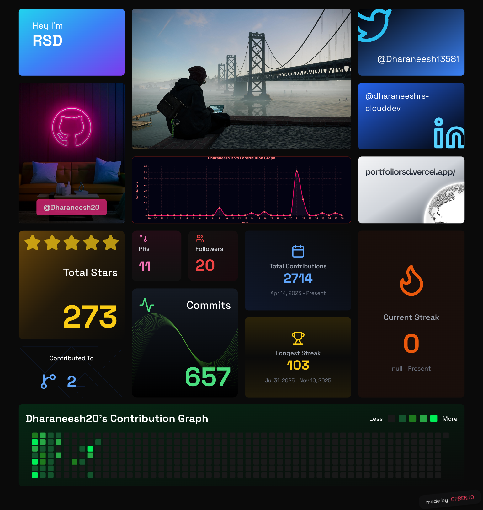

<!-- Animated Header -->

<!-- Typing Animation -->

 

<!-- Profile Views & Social Badges -->

 

Hey there!
-  **Currently working on:** Git Nanba AI, Agro Cloud Systems
-  **Currently learning:** Advanced C++, Spring Boot, AWS DevOps, React Native
-  **Reach me at:** dharaneeshrs@proton.me
-  **My Portfolio:** https://portfoliorsd.vercel.app/
 
 

##  Tech Arsenal

##  Featured Projects

| 🚀 Project | 💡 Description | 🛠️ Tech Stack | 🔗 Links |
|:-----------|:---------------|:---------------|:---------|
| **🤖 Git PPM Assistant AI** | AI-powered development assistant with smart error handling and repository management | Python, Flask, Generative AI |   |
| **🏥 MedAi** | Healthcare AI platform with medical diagnosis, drug interaction checker & health monitoring | Python, HuggingFace, Streamlit, MySQL |  |
| **🌾 Agro Cloud Systems** | Smart agriculture platform with IoT integration and crop yield prediction | Python, AWS, Azure, IoT, React, MongoDB |  |
| **🚀 Intel Unnati AI CI/CD** | Automated CI/CD framework for AI model integration and deployment | Jenkins, Docker, Kubernetes, Python |  |
| **💾 Smart Disk Analyzer** | A free, open-source alternative to AOMEI for disk & partition management. | Spring Boot, React, Electron, Java |   |

 

## 🤝 Let's Connect & Collaborate

### Building the future, one commit at a time! 🚀

### ⭐ Star my repositories if you find them interesting!

 
<!-- Animated Footer -->

